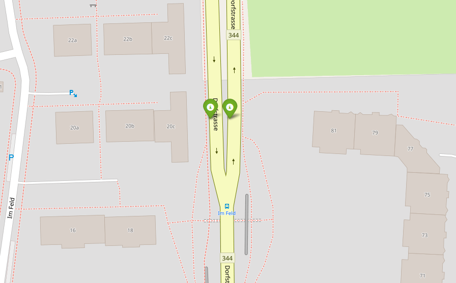
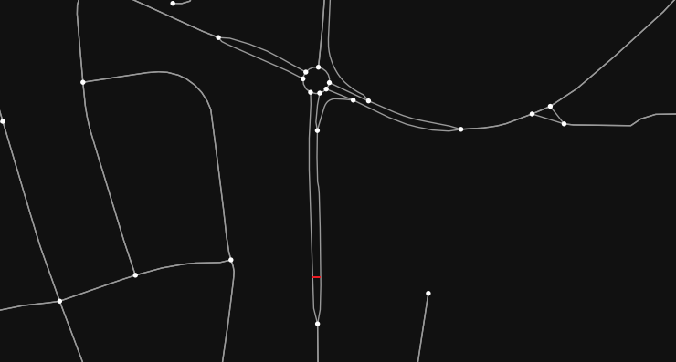
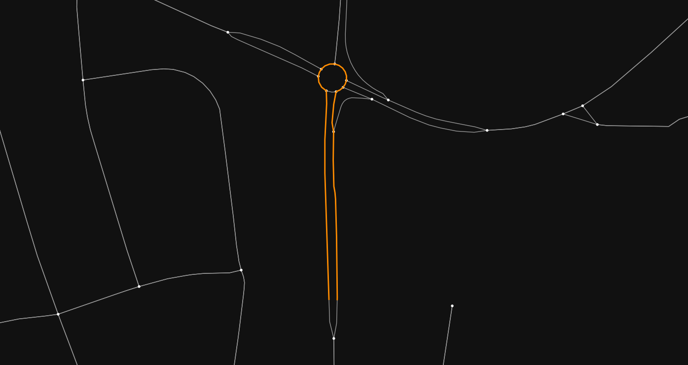

# Road Network Weighted Adjacency Matrix Calculator

This project's aim is to provide a method for calculating a weighted adjacency matrix for georeferenced points on a road network by taking into account the road network's properties.
This approach seeks to enhance the performance of methods reliant on weighted adjacency matrices (i.e. graph neural networks) by incorporating the often overlooked information present in the road network.  
Regarding georeferenced points, it is not uncommon for current methods to only take into account their direct distance (e.g. haversine, vincenty) but in several cases, such as traffic flow prediction, this is bound to result in sub-optimal results. For example in the case pictured below, the two points might appear to be close (direct distance), while in reality they are much further away (due to the directions of the road network).

<table align='center'>
  <tr>
    <td>
      
    </td>
    <td>
      
    </td>
    <td>
      
    </td>
  </tr>
  <tr>
    <td colspan="3">
      Two georeferenced points displayed on an OpenStreetMap overlay (left), direct distance bewteen the two georeferenced points (center), and shortest route through the road network between the same points (right).
    </td>
  </tr>
</table>

To this end, the present method calculates the connectivity of any two points $a$ and $b$ with the following formula:  
  
$$connectivity_{a,b} = \frac{v(a,b)}{r(a,b)} \cdot e^{-\frac{r(a,b)}{k}}$$  
  
where $r(a,b)$ and $v(a,b)$ denote the shortest route through the road network and the shortest direct path (geodesic distance) between the two points (in kilometers), respectively, while k serves as a parameter regulating the resulting matrix's connectivity. The higher the k, the higher the resulting network's connectivity.
